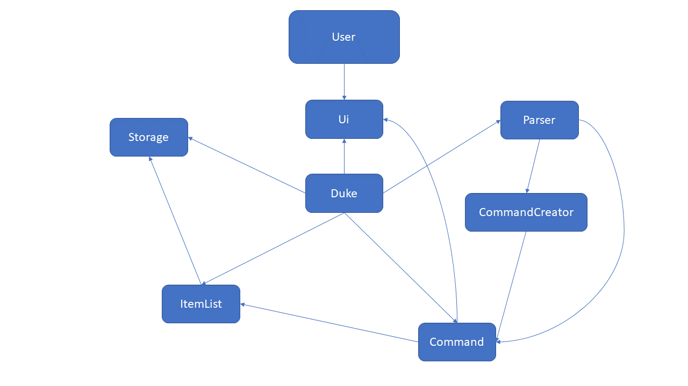

# Developer Guide

## Design & implementation
<!-- @@author iamchenjiajun -->
### Architecture

##### Architecture Diagram
Below is an architecture diagram of termiNus.



- `Duke` is the main object of the program and handles all the logic and models related to the program.
- `Ui` is the main object that provides an interface between `Duke` and the user.
- `Command` represents a command that is provided by the user. `Ui` reads the command and it is sent to `Parser` to create a new `Command` object.
- `Duke` executes the command and shows the output to the user using `Ui`.
- `Command` object modifies the state of `ItemList`, which consists of multiple lists for different types of `Items`.
- `Storage` takes the state of `ItemList` and stores it to file.

##### Sequence Diagram
Below is a sequence diagram of how the main program functions.


- First, the `main` function of the `Duke` class creates an instance of `Duke`.
- During the instantiation of `Duke`, a `Storage` object is created.
- `Duke` creates and loads the state of `ItemList` from file by calling a function from `Storage`.
- After `Duke` is initialized, the `Duke` class calls the `run()` method of `Duke`.
- `Duke` calls methods from `Ui` class and shows messages to the user.
- `Duke` reads commands from the user using the `Ui` class (which acts as an interface between `Duke` and the user).
- `Command` object is returned to `Duke` which is executed.
- `Command` object interacts with `ItemList` and changes its state.
- `Storage` saves the state of `ItemList` to file.
- `Duke` continues reading commands until a `ByeCommand` is generated by the user.

<!-- @@author -->
### Ui component

<!-- @@author iamchenjiajun -->
### Parser component

The `Parser` class is a class forming part of the logic of termiNus. The `Parser` parses user commands and
returns a `Command` subclass which corresponds to the full command with arguments.

#### High level description

The `Parser.parse()` method takes in `fullCommand` as an argument, which is the full command entered by the user.

Example commands:
- `add task tP meeting c/cs2113 p/0`
- `add module CS2113 mc/4 ay/2021S1 g/A`

The `fullCommand` is composed of several parts, which consists of a root command (`add`), description (`module CS2113`)
and optional arguments (`mc/4 ay/2021S1 g/A`).

An optional argument consists of 2 parts, which is delimited by a forward slash. In the example above, there are 3 optional
arguments, which are `mc/4`, `ay/2021S1` and `g/A`. Each optional argument can be represented in this form: `<key>/<value>`.

In some commands, the optional arguments may be compulsory and is checked by the `Parser` at runtime.

The `parse` method parses the `fullCommand` into these parts before passing them as arguments to `CommandCreator`
methods and returns a `Command` object with the corresponding arguments.

#### Implementation details

The following sequence diagram shows how the `Parser` works.


1. The `parse` method of `Parser` is invoked by the calling object. In termiNus, the only object that invokes this
method is `Duke`. The `fullCommand` is passed an argument, which is the full command entered by the user.
1. The method parses `fullCommand` into two separate `Strings`, which are `rootCommand` and `commandString`.
`rootCommand` contains the first word of the command and `commandString` contains the rest of the command with the first
word removed. This is done using the `split` method of the `String` class, then removing the `rootCommand` from the 
`fullCommand` before storing it in `commandString`.
1. The method then invokes the `removeArgumentsFromCommand` method to parse and remove optional arguments from the full
command. This is done using regular expression parsing which is detailed in the next section. The results are returned
to the `parse` method and stored in `description`.
1. The method then invokes the `getArgumentsFromRegex` method to parse the optional arguments from the full command.
The results are stored in a `HashMap<String, String>`, which is a `HashMap` of key-value pairs, similar to the form of the
optional argument (`<key>/<value>`). The results are returned to the `parse` method and stored as `argumentsMap`.
1. The method then checks the `rootCommand` and decides which `Command` to return, which calls `CommandCreator`
methods with the parsed `argumentsMap`, `description`, and `commandString`.
1. The results of the `CommandCreator` methods are returned as a `Command` back to the invoker of the `parse` method.

#### Regular expression parsing

Two of the previously mentioned methods, `removeArgumentsFromCommand` and `getArgumentsFromRegex` make use of regular
expressions to parse the optional arguments.

- The regular expression that parses these optional arguments is `([\w]+/[^\s]+)`. This regular expression matches 1 or more
alphanumeric characters (denoted by `[\w]+`), followed by a forward slash, then 1 or more of any character except whitespace (denoted by `[^\s]+`).
- The expression also uses capturing parenthesis to ensure that the parser does not parse the same argument twice.

#### Design considerations

- The results of `getArgumentsFromRegex` are stored as a `HashMap` instead of `ArrayList` or simply returned as a value.
This allows the same method to be reused for different commands, which may accept different optional arguments with
different key-value pairs. This ensures that the code follows DRY principles.
- The regular expressions parsing means that we do not need to manually parse every different command with different
arguments, thus reducing code complexity and SLOC.

<!-- @@author -->
### Command component

### Storage component


## Product scope
### Target user profile
Undergraduate students of National University of Singapore who:
- require help to better manage their school work.
- forgets to return their loan books to the library on time.
- wants a timetable planner for easy reference.
- are lazy to create separate module folders every semester.
- wish to calculate their CAP.

### Value proposition
termiNus is an application which helps NUS undergraduates to better manage their school life, by providing daily task or
borrowed books tracking, and module-related functions. This increase users' efficiency and make their life more organized.

## User Stories
|Version|Priority| As a ... | I want to ... | So that I can ...|
|--------|----------|----------|---------------|------------------|
|v1.0|***|student|add tasks into a list|keep track of the things I need to do|
|v1.0|***|student|assign priorities to tasks|focus on the more important things first|
|v1.0|**|student|assign categories to tasks|have a more organised task list|
|v1.0|***|student|mark tasks as done|keep track of the remaining tasks to do|
|v1.0|**|student|list all tasks in my list|have a better overview|
|v1.0|***|student|be able to delete unwanted tasks|focus on the tasks which I need|
|v1.0|***|student|save all data after using the application|retrieve the data upon running the application
|v2.0|**|student|automatically create folders for my modules|I do not have to manually create them|
|v2.0|***|student|add recurring tasks|avoid adding the same tasks every week
|v2.0|***|student|have a calendar|I can view my current and upcoming tasks
|v2.0|***|student|be able to set a tracker my borrowed books|avoid overdue fines
|v2.0|**|student|sort my tasks based on highest priority|focus on those tasks first
|v2.0|***|student|save zoom links in a centralized place|easily attend my online classes instead of looking through my email for the link 
|v2.0|***|student|add modules and calculate my CAP|have a better projection of my grades and efforts
|v2.0|*|student|login with a password|my system is protected 

## Implementation
#####Add tasks
Step 1
step 2

##### List tasks
The list tasks feature allows the user to list all the tasks tracked.
This feature is facilitated by `ListCommand`. 
- Step 1 The user inputs the command `list tasks`. (Assuming the task list is not empty)
- Step 2 The full command string will be parsed by `Parser`, whose `parse()` method returns a `CommandCreator` object to create a `ListCommand`.
- Step 3 The method `createListCommand()` in `CommandCreator` further parses the input by identifying the keyword `tasks`, and returns a `ListCommand` for the whole task list.
- Step 4 The command is executed and the complete list of all the tracked tasks is displayed.

##### List tasks with priority
The list tasks with priority feature allows the user to list tasks of a certain priority.
This feature is facilitated by `Parser` and `ListCommand`.
- Step 1 The user inputs the command `list tasks p/3`. (Assuming the tasks of CS2113 is not empty)
- Step 2 The full command string will be parsed by `Parser`, whose `parse()` method returns a `CommandCreator` object to create a `ListCommand`.
- Step 3 The method `createListCommand()` in `CommandCreator` further parses the input by identifying the keyword `tasks` and `p/`, and returns a `ListCommand` for the task list of priority level 3.
- Step 4 The command is executed and the list of tasks with level 3 priority is displayed.

##### List tasks with category
The list tasks with category feature allows the user to list tasks of a certain category.
This feature is facilitated by `Parser` and `ListCommand`.
- Step 1 The user inputs the command `list tasks c/CS2113`. (Assuming the tasks of CS2113 is not empty)
- Step 2 The full command string will be parsed by `Parser`, whose `parse()` method returns a `CommandCreator` object to create a `ListCommand`.
- Step 3 The method `createListCommand()` in `CommandCreator` further parses the input by identifying the keyword `tasks` and `c/`, and returns a `ListCommand` for the task list under CS2113 category.
- Step 4 The command is executed and the list of tasks categoried by CS2113 is displayed.

##### Add links
The add links feature allows the user to add and save zoom meeting links of modules.
This feature is faclitated by `Parser`, `AddCommand` and `Storage`.
- Step 1 The user inputs `add links m/CS2113 t/lecture u/https://nus.sg.zoom.us/cs2113/lecture`.
- Step 2 The full command string will be parsed by `Parser`, whose `parse()` method returns a `CommandCreator` object to create a `AddCommand`.
- Step 3 The method `createAddCommand()` in `CommandCreator` further parses the input by identifying the keyword `link`, and returns a `AddCommand`.
- Step 4 The command is excuted and the links is added into the link list with module name and online class type.
- Step 5 `Storage` saves the added link by writing it into the `links.txt` file.

##### List links
The list link feature allows the user to list all the zoom meeting links.
This feature is facilitated by `Parser` and `AddCommand`.
- Step 1 The user inputs `list links`. (Assuming the link list is not empty).
- Step 2 The full command string will be parsed by `Parser`, whose `parse()` method returns a `CommandCreator` object to create a `ListCommand`.
- Step 3 The method `createListCommand()` in `CommandCreator` further parses the input by identifying the keyword `links`, and returns a `ListCommand` for the link list.
- Step 4 The command is excuted and the complete list of links is displayed.

##### Calendar command
The calendar command allows users to print out a calendar view of their tasks within the next `X` days, where `X` is a parameter passed by the user.

- `CalendarCommand` obtains a list of tasks from `TaskList` by using its `getTaskList` method, which returns an `ArrayList` of `Task` objects.
- The list of tasks is converted into a `Stream`.
- The `Task` objects without dates are filtered out.
- The `Task` objects outside the range of the current date and `X` days of the current date are filtered out.
- The `ArrayList` is sorted by task dates, which uses a `Comparator` defined in the parameters.
- The `Stream` is collected back into an `ArrayList`, which has sorted dates of tasks within the next `X` days.
- The `ArrayList` of `Task` objects are passed to the `Ui.dukePrintCalendar` method, which prints the tasks as a calendar.
- The `dukePrintCalendar` method groups tasks by date and a new heading is printed for each day. This is done by comparing each `Task` in the loop with the
previous task to check if they have the same date, and to print a new heading if not.

The filtering of the tasks by date is done using this code, which is called on a `Stream` object.
```
    .filter(task -> currentDate.until(task.getDate(), ChronoUnit.DAYS) >= 0)
    .filter(task -> currentDate.until(task.getDate(), ChronoUnit.DAYS) <= daysToPrint)
```

## Non-Functional Requirements

{Give non-functional requirements}

## Glossary

* *glossary item* - Definition

## Instructions for manual testing

{Give instructions on how to do a manual product testing e.g., how to load sample data to be used for testing}
