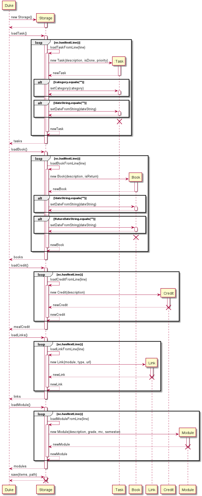

# Developer Guide

## Design & implementation

{Describe the design and implementation of the product. Use UML diagrams and short code snippets where applicable.}

### Architecture

### Ui component

<!-- @@author iamchenjiajun -->
### Parser component

The `Parser` class is a class forming part of the logic of termiNus. The `Parser` parses user commands and
returns a `Command` subclass which corresponds to the full command with arguments.

#### High level description

The `Parser.parse()` method takes in `fullCommand` as an argument, which is the full command entered by the user.

Example commands:
- `add task tP meeting c/cs2113 p/0`
- `add module CS2113 mc/4 ay/2021S1 g/A`

The `fullCommand` is composed of several parts, which consists of a root command (`add`), description (`module CS2113`)
and optional arguments (`mc/4 ay/2021S1 g/A`).

An optional argument consists of 2 parts, which is delimited by a forward slash. In the example above, there are 3 optional
arguments, which are `mc/4`, `ay/2021S1` and `g/A`. Each optional argument can be represented in this form: `<key>/<value>`.

In some commands, the optional arguments may be compulsory and is checked by the `Parser` at runtime.

The `parse` method parses the `fullCommand` into these parts before passing them as arguments to `CommandCreator`
methods and returns a `Command` object with the corresponding arguments.

#### Implementation details

The following sequence diagram shows how the `Parser` works.

1. The `parse` method of `Parser` is invoked by the calling object. In termiNus, the only object that invokes this
method is `Duke`. The `fullCommand` is passed an argument, which is the full command entered by the user.
1. The method parses `fullCommand` into two separate `Strings`, which are `rootCommand` and `commandString`.
`rootCommand` contains the first word of the command and `commandString` contains the rest of the command with the first
word removed. This is done using the `split` method of the `String` class, then removing the `rootCommand` from the 
`fullCommand` before storing it in `commandString`.
1. The method then invokes the `removeArgumentsFromCommand` method to parse and remove optional arguments from the full
command. This is done using regular expression parsing which is detailed in the next section. The results are returned
to the `parse` method and stored in `description`.
1. The method then invokes the `getArgumentsFromRegex` method to parse the optional arguments from the full command.
The results are stored in a `HashMap<String, String>`, which is a `HashMap` of key-value pairs, similar to the form of the
optional argument (`<key>/<value>`). The results are returned to the `parse` method and stored as `argumentsMap`.
1. The method then checks the `rootCommand` and decides which `Command` to return, which calls `CommandCreator`
methods with the parsed `argumentsMap`, `description`, and `commandString`.
1. The results of the `CommandCreator` methods are returned as a `Command` back to the invoker of the `parse` method.

#### Regular expression parsing

Two of the previously mentioned methods, `removeArgumentsFromCommand` and `getArgumentsFromRegex` make use of regular
expressions to parse the optional arguments.

- The regular expression that parses these optional arguments is `([\w]+/[^\s]+)`. This regular expression matches 1 or more
alphanumeric characters (denoted by `[\w]+`), followed by a forward slash, then 1 or more of any character except whitespace (denoted by `[^\s]+`).
- The expression also uses capturing parenthesis to ensure that the parser does not parse the same argument twice.

#### Design considerations

- The results of `getArgumentsFromRegex` are stored as a `HashMap` instead of `ArrayList` or simply returned as a value.
This allows the same method to be reused for different commands, which may accept different optional arguments with
different key-value pairs. This ensures that the code follows DRY principles.
- The regular expressions parsing means that we do not need to manually parse every different command with different
arguments, thus reducing code complexity and SLOC.

<!-- @@author -->
### Command component

<!-- @@author GuoAi -->
### Storage component  

The `Storage` class is a class loading data from files when Duke starts and saving data to files after each command.

#### High level description

Methods handling data loading (i.e. `loadTask()`, `loadBook()`, `loadLinks()`, `loadCredit()`, `loadModule()` methods) 
return an `ArrayList` of `Item`s (i.e. `Task`, `Book`, `Link`, `Credit`, `Module`). These will be the initial values of 
the `ItemList`. The `save()` method takes an `ItemList` and a `String` specifying the path to which the file will be 
saved. The `ItemList` will be parsed and saved into files (each `ItemList` will be saved to a separate file) at the 
specified path.  
  
Formats of the files: 
  
- `tasks.txt`:  
  
There are 6 fields stored for each `Task`:  
1. String `T` for "Task"  
2. Whether the `Task` has been done or not (1 for done, 0 for not done)  
3. Description of the `Task`  
4. Priority of the `Task` (an Integer)
5. Category of the `Task`
6. Date of the `Task`  
  
All the fields are separated by ` | ` with a leading and a trailing space. Each `Task` is stored as one line.  
  
Example: `T | 0 | borrow book | 1 | book | 28-10-2020`  
  
- `books.txt`:  

There are 5 fields stored for each `Book`:  
1. String `B` for "Book"  
2. Whether the `Book` has been returned or not (1 for returned, 0 for not returned)   
3. Name/Description of the `Book`  
4. Borrow date of the `Book`  
5. Return date of the `Book`  

All the fields are separated by ` | ` with a leading and a trailing space. Each `Book` is stored as one line.  
  
Example: `B | 0 | cooking book | 11-11-2011 | 11-12-2011`  
  
- `links.txt`:  

There are 3 fields stored for each `Link`:  
1. Module of the `Link`  
2. Type of the `Link`  
3. URL of the `Link`  
  
All the fields are separated by ` | ` with a leading and a trailing space. Each `Link` is stored as one line.  

Example: `CS2113 | lecture | https://cs2113Lecture.zoom.com`  
  
- `modules.txt`:  

There are 4 fields for each `Module`:  
1. Module code  
2. Grade  
3. Modular credits  
4. Academic year and semester  

All the fields are separated by ` | ` with a leading and a trailing space. Each `Module` is stored as one line.  
  
#### Implementation details

The following sequence diagram shows how the `Storage` works.

  
1. At the start of `Duke`, a new `Storage` object will be created.
2. `Duke` calls loading methods (i.e. `loadTask()`, `loadBook()`, `loadCredit()`, `loadLinks()`, `loadModule()`) 
sequentially. Each loading method calls the corresponding helper method (i.e. `loadTaskFromLine()`, `loadBookFromLine()`, 
`loadCreditFromLine()`, `loadLinkFromLine()`, `loadModuleFromLine()`) to load `Item`s from each line in the file. 
3. After each command, `Duke` calls the `save()` method of `Storage` to save all the `Item`s in the list to files.

## Product scope
### Target user profile
{Describe the target user profile}

Undergraduate students of National University of Singapore.

### Value proposition
{Describe the value proposition: what problem does it solve?}

termiNus is an application which helps NUS undergraduates to have better management of study and daily life, by providing tasks, expenses, meal credits and borrowed books tracking, and module-related functions. It can increase users' efficiency and make their life easier.

## User Stories
|Version| As a ... | I want to ... | So that I can ...|
|--------|----------|---------------|------------------|
|v1.0|new user|see usage instructions|refer to them if I don't know how to use the application|
|v1.0|user|add tasks into a list|keep track of the things I need to do|
|v1.0|student|assign priorities to tasks|focus on the more important things first|
|v1.0|student|assign categories to tasks|have a more organised task list|
|v1.0|
|v1.0|
|v2.0|
|v2.0|
|v2.0|
|v2.0|
|v2.0|

## Implementation
Add tasks
Step 1
step 2

List tasks
Step 1
Step 2

## Non-Functional Requirements

{Give non-functional requirements}

## Glossary

* *glossary item* - Definition

## Instructions for manual testing

{Give instructions on how to do a manual product testing e.g., how to load sample data to be used for testing}
